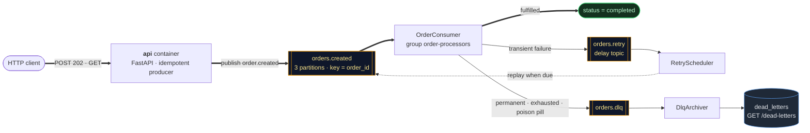

# OrderFlow — event-driven order processing

A small but production-shaped order pipeline built on **FastAPI + Kafka + Redis + Postgres**.

`POST /orders` returns `202` in milliseconds and hands the work to Kafka. A consumer group
validates and fulfils each order, retries transient failures on a delay topic with
exponential backoff, and dead-letters what it can't process. `GET /orders/{id}` is served
cache-aside from Redis with Postgres as the fallback and the source of truth.

The point of the project is the hard parts, not the CRUD: **at-least-once delivery made
effectively-once with a Redis idempotency guard**, a real **retry → DLQ** ladder, and a
**cache-aside** read path that degrades to "slow" rather than "down" when Redis is gone.

---

## Architecture



`POST /orders` writes the order (`pending`) to Postgres, dedupes on an optional
`Idempotency-Key` with Redis `SET NX`, and publishes `order.created` keyed by order id.
`GET /orders/{id}` reads cache-aside: Redis first, Postgres as the fallback that refills the
cache. Order status is `pending → processing → completed | failed`, with every hop recorded
in an append-only `order_transitions` audit trail.

**Full diagrams and end-to-end flow: [docs/ARCHITECTURE.md](docs/ARCHITECTURE.md)** — system
topology, the write and read sequence diagrams, the consumer decision tree, both state
machines (order + idempotency guard), the retry ladder, the data model, partition
assignment, the Redis keyspace, and a failure-mode table.

---

## Quick start

```bash
make up
```

Then open <http://localhost:8000/docs>, or run the guided walkthrough:

```bash
./scripts/demo.sh
```

The demo exercises the happy path, a cache eviction and refill, a double-submitted
`Idempotency-Key`, a transient failure walking the retry ladder into the DLQ, and a
permanent failure that skips retries entirely.

| Service           | URL                          |
| ----------------- | ---------------------------- |
| API + Swagger     | http://localhost:8000/docs   |
| Health            | http://localhost:8000/health |
| Kafka UI (opt-in) | http://localhost:8090        |
| Postgres          | `localhost:5433`             |
| Redis             | `localhost:6380`             |
| Kafka             | `localhost:29092`            |

Kafka UI is behind a compose profile: `make up-tools`.

---

## API

| Method | Path                 | Notes                                                    |
| ------ | -------------------- | -------------------------------------------------------- |
| POST   | `/orders`            | `202 Accepted`; honours an `Idempotency-Key` header       |
| GET    | `/orders/{id}`       | Cache-aside; the response says `source: cache\|database`  |
| GET    | `/orders`            | Filter with `?status=pending`                             |
| GET    | `/dead-letters`      | What the DLQ consumer archived, and why                   |
| GET    | `/stats`             | Redis pipeline counters + order totals from Postgres      |
| GET    | `/health`            | `503` when any dependency is down                         |

```bash
# submit
curl -X POST localhost:8000/orders -H 'content-type: application/json' \
  -d '{"customer_id":"alice","sku":"WIDGET-1","quantity":2,"amount_cents":4999}'

# read (watch `source` flip from database to cache)
curl localhost:8000/orders/<id>
```

Two demo hooks make the failure paths reproducible on demand:

```bash
# fails every attempt → retries with backoff → DLQ
-d '{"customer_id":"c","sku":"W-3","quantity":1,"amount_cents":999,"fail_mode":"transient"}'

# unknown SKU → permanent failure → DLQ immediately, no retries
-d '{"customer_id":"c","sku":"BAD-404","quantity":1,"amount_cents":100}'
```

---

## The parts worth reading

### Idempotency — [`app/idempotency.py`](app/idempotency.py)

Kafka gives at-least-once delivery. A rebalance, a crash between processing and committing,
or a retry replay will all hand the consumer the same event twice. The guard is a three-state
machine on one Redis key per `event_id`:

```
(absent) --SET NX--> <token> --CAS--> "done"
                        |
                        +-- CAS release (on transient failure) --> (absent)
```

* `SET key <token> NX EX ttl` is the atomic claim — exactly one consumer wins, and the TTL
  is set in the *same* command so a crashed consumer can never wedge an event forever.
* A loser reading `"done"` knows the work already happened: skip **and commit**.
* A loser reading someone else's token knows a peer is mid-flight: skip and **do not
  commit**, so the message is redelivered if that peer dies.
* Release and completion both go through a compare-and-set Lua script, so a consumer whose
  lock already expired can never clobber the newer owner's state.

The honest caveat: `IDEMPOTENCY_LOCK_TTL_SECONDS` must exceed the worst-case processing time
of one message. If it doesn't, the lock expires mid-flight and a concurrent delivery really
can process the event twice — which is why the consumer *also* refuses to reprocess an order
that already reached a terminal status. Two independent guards, because the lock alone is a
liveness/safety trade, not a proof.

### Retry and dead-lettering — [`app/kafka/consumers.py`](app/kafka/consumers.py)

Failures are split into two kinds ([`app/errors.py`](app/errors.py)) because they deserve
opposite treatment:

* **`TransientError`** (timeout, downstream 503) — republished to `orders.retry` with an
  `x-attempt` counter and an `x-not-before` timestamp. `RetryScheduler` holds it until it's
  due and replays it onto `orders.created`. After `MAX_ATTEMPTS` it's dead-lettered.
* **`PermanentError`** (bad payload, unknown SKU) — dead-lettered on the first failure.
  Retrying a payload that can never succeed only burns capacity and delays real work.

Retry bookkeeping rides in **Kafka headers**, not in the body, so a replayed record is
byte-identical to the original. Backoff is exponential with **full jitter** — without jitter,
a batch that failed together comes back together and hammers the recovering dependency in
lockstep.

`DlqArchiver` consumes `orders.dlq` and persists each record to Postgres, because a DLQ
nobody can read is just a slower way of dropping messages.

### Cache-aside — [`app/cache.py`](app/cache.py)

Read: Redis `GET` → hit? return : Postgres → `SETEX` → return.
Write: DB commit → refresh the cached copy, so a status change is visible immediately.

Every Redis call on this path is wrapped: a cache outage, a corrupt entry, or a schema drift
in a cached blob all degrade to a database read rather than a `500`. The TTL is the safety
net — if a worker dies between the DB commit and the cache write, the stale entry ages out
on its own.

### Delivery guarantees, end to end

| Concern                        | How it's handled                                                     |
| ------------------------------ | -------------------------------------------------------------------- |
| Producer retry duplicates      | `enable_idempotence=True`, `acks=all`                                 |
| Per-order ordering             | Kafka key = `order_id`, so one order → one partition                  |
| Lost messages on crash         | `enable_auto_commit=False`; commit only after the work is durable     |
| Duplicate processing           | Redis `SET NX` guard + terminal-status check                          |
| Poison pills                   | Undecodable records go straight to the DLQ, never block the partition |
| A peer holding the lock        | Redeliver without committing — never commit work you didn't do        |
| Client double-submit           | `Idempotency-Key` header → Redis `SET NX` → returns the original order |

### Known gap: the dual write

`POST /orders` commits to Postgres and *then* publishes to Kafka. Two systems, no shared
transaction — if the process dies in between, the order sits at `pending` forever. The
production fix is a **transactional outbox**: write the event into an `outbox` table in the
same transaction as the order, and relay it to Kafka with a separate CDC process. It's
flagged in [`app/service.py`](app/service.py) rather than quietly ignored; implementing it
would have doubled the moving parts without teaching anything new about Kafka or Redis.

---

## Scaling and observability

```bash
make scale      # 3 worker replicas; the group coordinator splits the partitions
make lag        # consumer-group lag per partition
make topics     # list topics
make dlq        # dump the dead-letter topic
make keys       # inspect the Redis keyspace
```

With 3 partitions on `orders.created`, up to 3 processor replicas do useful work; a 4th sits
idle. Because the Kafka key is the order id, all events for a given order still land on one
replica, in order.

Redis keyspace:

| Key                    | Purpose                                       |
| ---------------------- | --------------------------------------------- |
| `order:{id}`           | Cache-aside entry, TTL `CACHE_TTL_SECONDS`    |
| `idem:event:{eventid}` | Consumer idempotency guard (`<token>` / `done`) |
| `idem:api:{key}`       | `Idempotency-Key` → order id                  |
| `stats`                | Hash of pipeline counters (`HINCRBY`)         |

---

## Development

```bash
make install    # uv sync
make test       # unit tests — no Docker needed
make lint
```

The unit suite runs against `fakeredis` and in-memory SQLite, so the idempotency state
machine, the cache-aside degradation paths, the retry-header round trip and the HTTP contract
are all testable without a broker.

Configuration is environment-driven ([`app/config.py`](app/config.py)); see
[`.env.example`](.env.example) to run the API or worker on the host against the compose
infrastructure.

## Layout

```
app/
  main.py            FastAPI app + lifespan (schema, topics, producer)
  worker.py          Runs all three consumers in one event loop
  api/routes.py      HTTP surface
  service.py         Submit + cache-aside read
  idempotency.py     Redis SET NX / CAS guard
  cache.py           Cache-aside helpers
  processing.py      Business rules + backoff policy
  errors.py          Transient vs permanent
  repository.py      All DB access
  models.py          orders, order_transitions, dead_letters
  kafka/
    admin.py         Declarative topic creation
    producer.py      Idempotent producer
    consumers.py     OrderConsumer, RetryScheduler, DlqArchiver
    headers.py       Retry metadata carried in record headers
```
