# OrderFlow — architecture and application flow

Every diagram here is Mermaid, so it renders directly on GitHub.

- [1. System topology](#1-system-topology)
- [2. Write path — `POST /orders`](#2-write-path--post-orders)
- [3. Read path — `GET /orders/:id`](#3-read-path--get-ordersid)
- [4. Consumer flow — the decision tree](#4-consumer-flow--the-decision-tree)
- [5. Order state machine](#5-order-state-machine)
- [6. Idempotency guard state machine](#6-idempotency-guard-state-machine)
- [7. Retry ladder and dead-lettering](#7-retry-ladder-and-dead-lettering)
- [8. Data model](#8-data-model)
- [9. Scaling and partition assignment](#9-scaling-and-partition-assignment)
- [10. Redis keyspace](#10-redis-keyspace)
- [11. Failure modes and what happens](#11-failure-modes-and-what-happens)

---

## 1. System topology

Two application processes (`api` and `worker`) over three backing services. The API only
ever *produces*; the worker only ever *consumes and re-produces*. Postgres is the source of
truth for both; Redis holds nothing that cannot be rebuilt from Postgres — except the
idempotency guards, which is why Redis runs with AOF persistence.

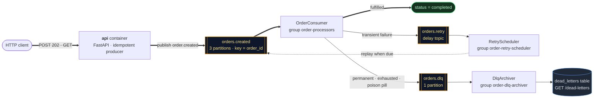

Amber boxes are Kafka topics, lavender are application components. Bold edges are the happy
path; the dashed edge is the retry replay. `OrderConsumer`, `RetryScheduler` and
`DlqArchiver` all run inside the **worker** container — in separate consumer groups, so they
scale independently of one another.

Which process touches which store, and why:

| Component | Redis | Postgres |
| --- | --- | --- |
| `api` — write path | `SET NX` on `Idempotency-Key`, warm the cache | `INSERT` order + first transition |
| `api` — read path | cache-aside `GET` / `SETEX` | fallback `SELECT`, source of truth |
| `OrderConsumer` | idempotency guard, pipeline counters | status transitions + audit trail |
| `DlqArchiver` | dead-letter counter | `INSERT` into `dead_letters` |

Nothing in Redis is irreplaceable except `idem:event:*` — see
[§10](#10-redis-keyspace) for why that one needs AOF persistence.

---

## 2. Write path — `POST /orders`

The endpoint does the minimum needed to make the order durable and hand it off. Simulated
fulfilment takes 300 ms; the HTTP response does not wait for it.

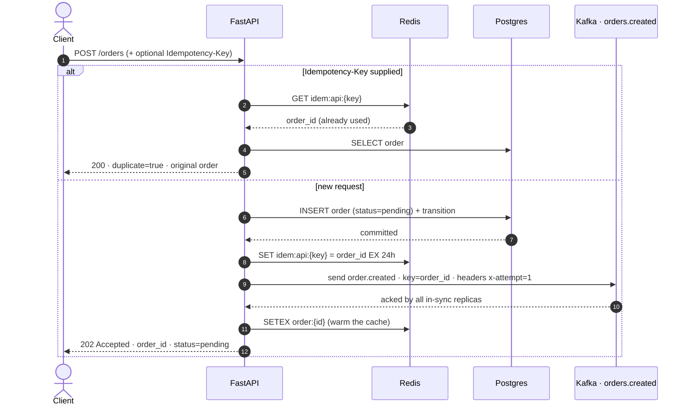

**Steps 5–7 are a dual write.** Postgres commits, *then* Kafka is told. If the process dies
between them the order stays `pending` forever. The production fix is a transactional
outbox; see the note in [`app/service.py`](../app/service.py).

Why the Kafka key is the order id: it pins every event for one order to one partition, so
retries and replays of the same order are processed in order by a single consumer.

---

## 3. Read path — `GET /orders/:id`

Classic cache-aside, with the response advertising where it was served from
(`"source": "cache" | "database"`) so the behaviour is observable rather than claimed.

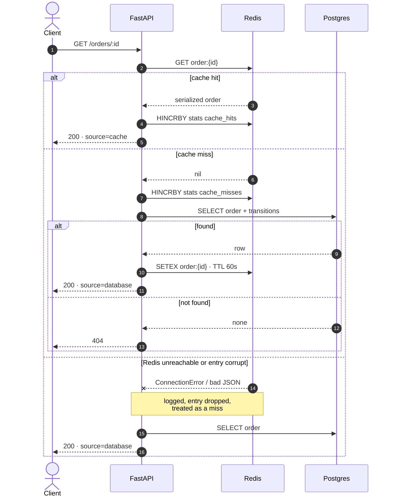

The third branch is the point: **a cache outage degrades the system to "slow", never to
"down"**. Every Redis call on this path is wrapped, and
[`tests/test_cache.py`](../tests/test_cache.py) injects a `BrokenRedis` to prove it.

The **write path keeps the cache fresh**: after each status transition the consumer
re-serializes the order into Redis (write-through), so a status change is visible on the
next read. The 60 s TTL is the safety net — if a worker dies between the DB commit and the
cache write, the stale entry ages out on its own.

---

## 4. Consumer flow — the decision tree

This is the heart of the system. Read it alongside
[`app/kafka/consumers.py`](../app/kafka/consumers.py).

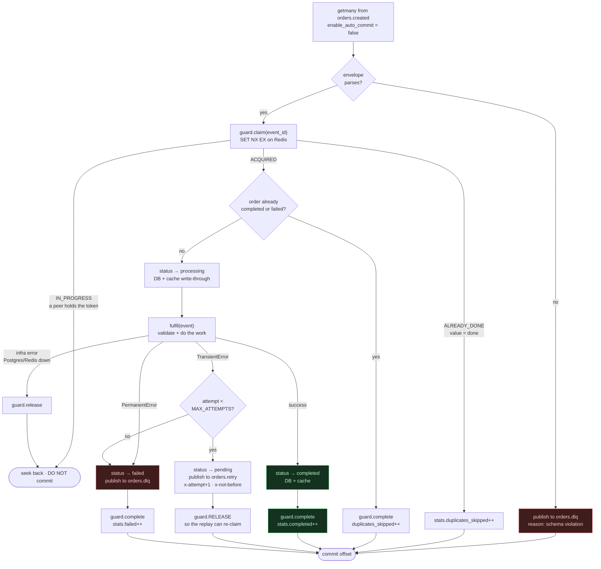

Three rules encoded in that graph are worth stating in words:

1. **Never commit an offset for work you did not do.** The `IN_PROGRESS` branch and the
   infra-error branch both refuse to commit, so the message is redelivered to somebody.
2. **`release` on transient failure, `complete` on terminal outcome.** Releasing hands the
   guard back so the retry replay can re-claim it; completing tombstones it as `done` so any
   future redelivery is skipped.
3. **The guard is marked `done` *before* the offset commit.** A crash in that window costs a
   duplicate delivery, which the guard absorbs — not a lost order.

---

## 5. Order state machine

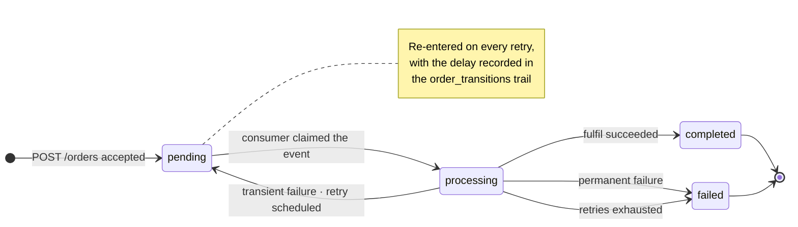

`completed` and `failed` are terminal and enforced: the consumer refuses to reprocess an
order already in either state, independently of the Redis guard. Two independent defences,
because a distributed lock is a liveness/safety trade-off, not a proof.

Every hop is appended to `order_transitions`, so `GET /orders/:id` returns the full history:

```
pending → processing → pending → processing → pending → processing → pending → processing → failed
        attempt 1            attempt 2            attempt 3            attempt 4
```

---

## 6. Idempotency guard state machine

One Redis key per `event_id`, at `idem:event:{event_id}`.

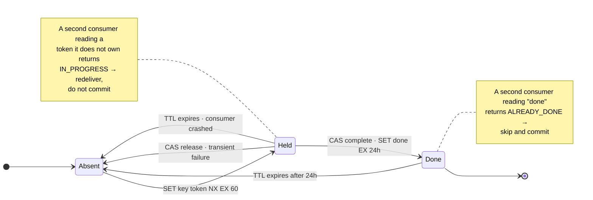

| Observation by a second consumer | `ClaimStatus` | What it does |
| --- | --- | --- |
| `SET NX` succeeded | `ACQUIRED` | process the event |
| key holds `done` | `ALREADY_DONE` | skip **and commit** — work already happened |
| key holds someone else's token | `IN_PROGRESS` | skip and **do not commit** — peer may die |

Both `release` and `complete` run as compare-and-set Lua scripts, so a consumer whose lock
already expired can never clobber the newer owner's state.

**The one assumption:** `IDEMPOTENCY_LOCK_TTL_SECONDS` (60 s) must exceed the worst-case
processing time of a single message. If it doesn't, the lock expires mid-flight and a
concurrent delivery genuinely can process the event twice — which is exactly why rule 2
above (the terminal-status check) exists as a second line of defence.

---

## 7. Retry ladder and dead-lettering

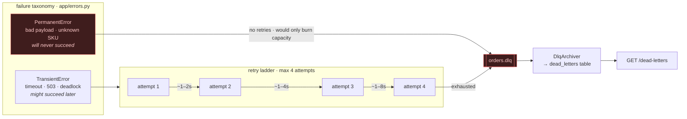

How a retry actually travels:

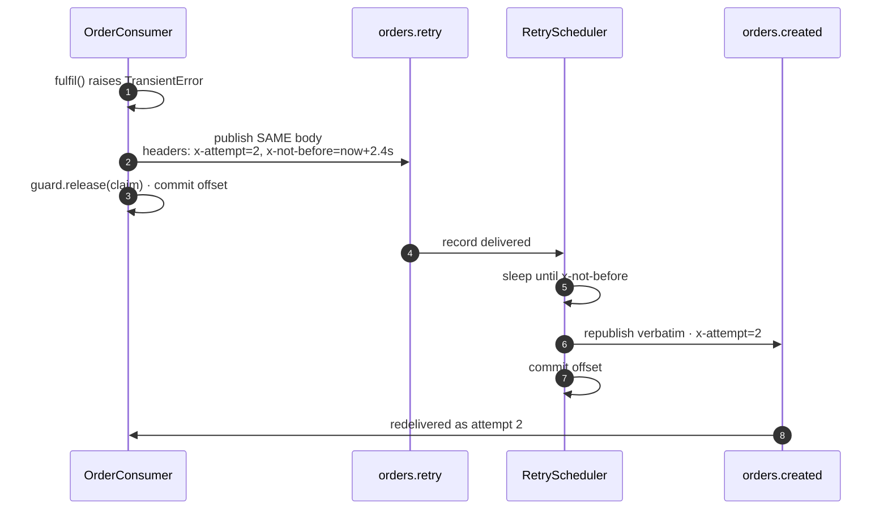

Three deliberate choices here:

- **Retry metadata lives in Kafka headers, not the message body.** A replayed record is
  byte-identical to the original, so the payload stays the immutable fact it claims to be.
- **Backoff is exponential with full jitter.** Without jitter, a batch of messages that
  failed together comes back together and hammers the recovering dependency in lockstep.
- **Sleeping in the scheduler is safe only because delays are capped at 60 s**, far below
  `max.poll.interval.ms`. A system needing hour-long delays would use tiered delay topics
  (`retry-5s` / `retry-1m` / `retry-30m`) so each consumer only ever sleeps a little.

---

## 8. Data model

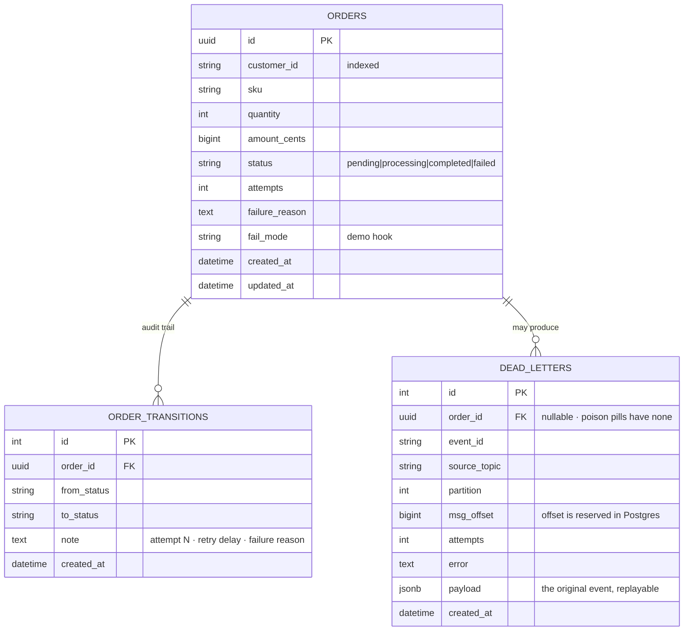

`dead_letters.payload` holds the original event verbatim, so a fixed bug can be followed by
replaying the row back onto `orders.created`.

---

## 9. Scaling and partition assignment

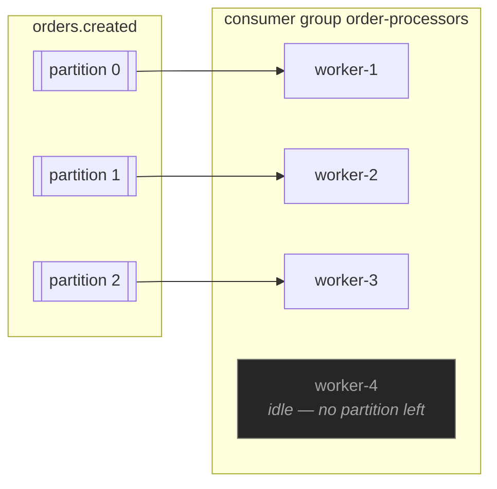

```bash
docker compose up -d --scale worker=3
```

Partition count is the parallelism ceiling: with 3 partitions, a 4th replica sits idle. Each
worker replica runs all three consumers, but they are in *different groups*, so the retry
scheduler and DLQ archiver scale independently of the processor.

Because the Kafka key is the order id, all events for one order land on one partition and
therefore on one replica, in order — even under a rebalance.

Verified: 60 concurrent orders across 3 replicas → 60 completed, 0 duplicates, drained in 8 s.

---

## 10. Redis keyspace

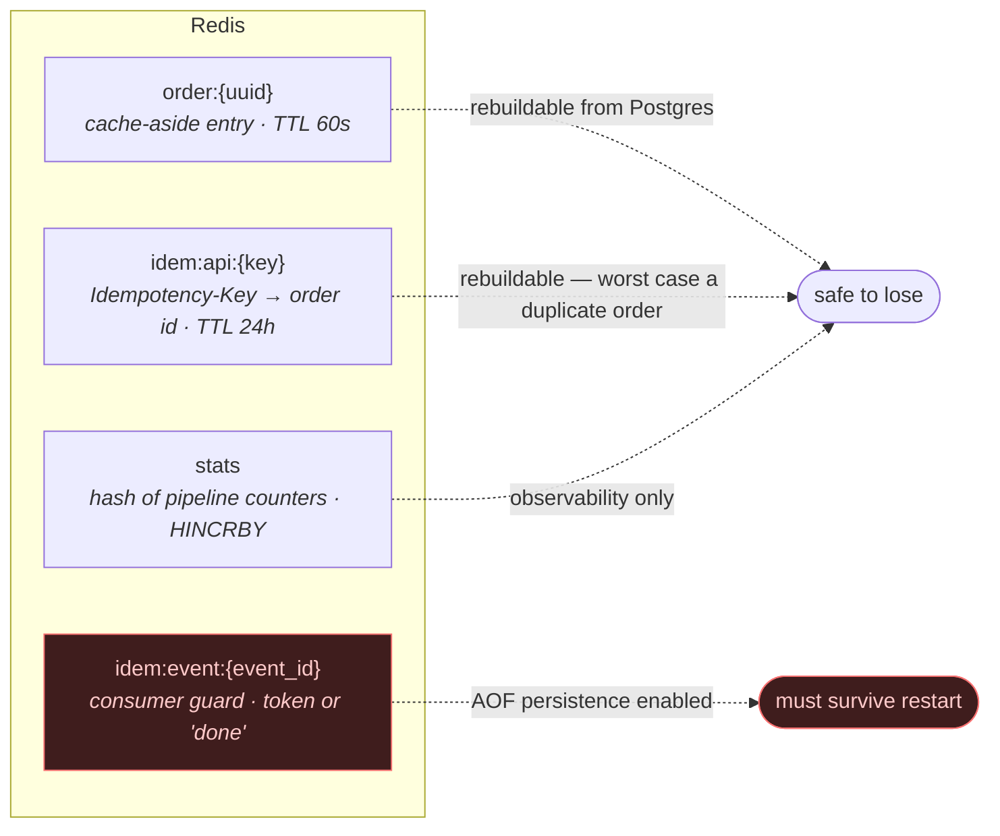

`idem:event:*` is the one Redis key that is not merely a cache: losing it mid-flight would
let an already-processed event through again. That is why the compose file runs Redis with
`--appendonly yes`.

---

## 11. Failure modes and what happens

| Failure | Behaviour | Guarded by |
| --- | --- | --- |
| Producer retries internally | No duplicate, no reorder within a partition | `enable_idempotence=True`, `acks=all` |
| API dies after DB commit, before publish | Order stuck at `pending` — **known gap** | Would need a transactional outbox |
| Worker dies mid-processing | Offset never committed → redelivered; guard TTL expires → re-claimable | Manual commit + guard TTL |
| Worker dies after `complete`, before commit | Redelivered, guard reads `done` → skipped | Idempotency guard |
| Two workers get the same event | One `ACQUIRED`, one `IN_PROGRESS` → redelivers without committing | `SET NX` |
| Guard TTL expires mid-flight | Terminal-status check refuses to reprocess | `TERMINAL_STATUSES` check |
| Undecodable record (poison pill) | Straight to DLQ; the partition never blocks | Envelope validation |
| Downstream dependency flaps | Up to 3 retries with jittered backoff, then DLQ | `TransientError` path |
| Invalid business payload | DLQ on first failure, no retries | `PermanentError` path |
| Redis down | Reads fall back to Postgres; counters silently skipped | Wrapped cache calls |
| Redis down *for the worker* | Consumer cannot claim → redelivers, does not commit | Fail-closed on the guard |
| Postgres down | Consumer releases the claim and redelivers; API `/health` returns 503 | `session_scope` rollback |
| Client double-submits | One order, one event | `Idempotency-Key` + `SET NX` |
| Cache entry corrupt or stale-shaped | Dropped, read falls through to Postgres | Wrapped deserialization |

---

## Where to read the code

| Concern | File |
| --- | --- |
| Idempotency guard (`SET NX` + CAS Lua) | [`app/idempotency.py`](../app/idempotency.py) |
| Consumer decision tree, retry, DLQ | [`app/kafka/consumers.py`](../app/kafka/consumers.py) |
| Cache-aside and its degradation paths | [`app/cache.py`](../app/cache.py) |
| Retry metadata in Kafka headers | [`app/kafka/headers.py`](../app/kafka/headers.py) |
| Transient vs permanent taxonomy | [`app/errors.py`](../app/errors.py) |
| Business rules and backoff policy | [`app/processing.py`](../app/processing.py) |
| Write path and the dual-write note | [`app/service.py`](../app/service.py) |
| Topic declarations | [`app/kafka/admin.py`](../app/kafka/admin.py) |
